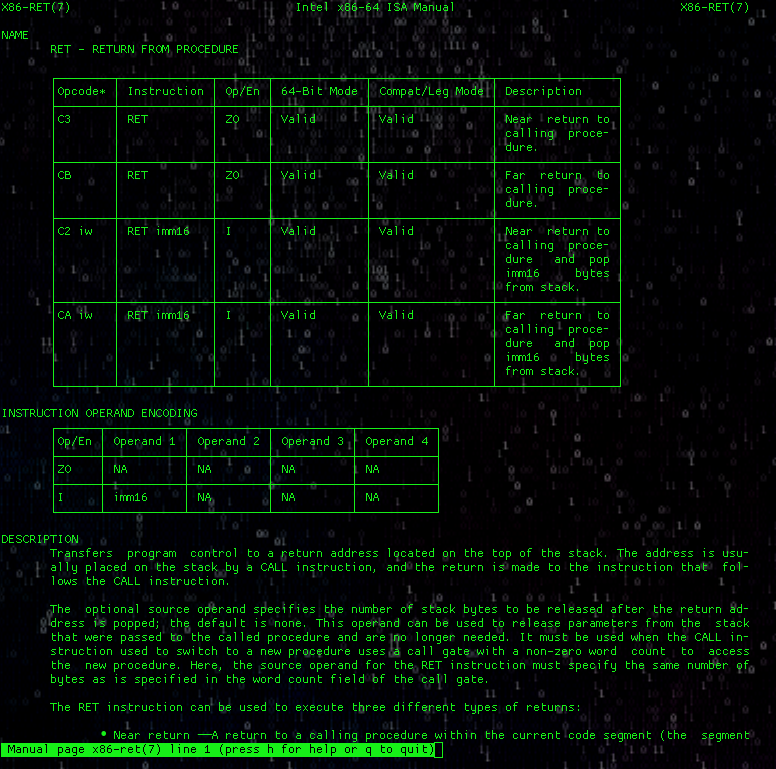

# x86-manpages

x86-64 komut mimarisi için man sayfaları. Man sayfalarına aşağıdaki gibi erişime olanak sağlamakta:

```
man x86-jmp
man x86-call
```

<p align="center">
  
</p>


`x86-manpages(7)` sayfasında man sayfasına ulaşabileceğiniz komutları görebilirsiniz.

## Kurulum

### Elle
```
$ git clone https://github.com/ttmo-O/x86-manpages && cd x86-manpages
# mkdir /usr/local/man/man7
# cp manpages/* /usr/local/man/man7/
```
veya "manpages" dizinini `MANPATH` çevresel değişkeninize ekleyin.

### AUR ile

AUR'dan [x86-manpages-git](https://aur.archlinux.org/packages/x86-manpages-git/) paketini edinebilirsiniz.

### NIX ile

Nix paket yöneticisi ile şuradan kurabilirsiniz [https://github.com/blitz/x86-manpages-nix](https://github.com/blitz/x86-manpages-nix).

## Yöntem

Man sayfaları, intel'in resmi dökümanından şu şekilde oluşturuldu:

PDF --> html --> markdown --> man page

İntel'in PDF dökümanlarının html'e çevrilmesi işi [Félix Cloutier](https://www.felixcloutier.com/x86/index.html) tarafından yapıldı; ki işin büyük kısmı buydu.

Diğer aşamalar ise çeşitli araçların yardımı ile bu projede gerçeklendi. "scripts" dizinine bakınız.


## Katkı

Geliştiricisi, var olan hataların göz ardı edilebilir olduğunu düşündüğünden, hata üreten script'leri iyileştirmeye çalışmaktan vazgeçti. Ayrıca amaç mükemmeliyet değildi. Eğer gördüğünüz bir mükemmeliyetsizliğe tahammül edemiyorsanız, lütfen script'lerimizi adam edecek PR'lar gönderin. Yahut, eğer "troff" biliyorsanız, doğrudan ("manpages" dizinindeki) çıktılar üzerinde iyileştirmeler yapabilirsiniz, PR'ınızı bekliyoruz.

### Hatalar

Script'lerle otomatize edildiğinden dolayı, çıktılarda bazı hatalar bulunmakta. Bunların çoğu tablolarla, ve özellikle de `rowspan`larla ilgili. Şu an için `rowspan-normalizer` script'i th ve tr rowspan'larını düzleştirebilecek yeteneğe sahip değil. Ayrıca `[` ve `]` ve bazı diğer karakterle oluşan tabloları kırabilmekte; bunlardan muhtemelen döküman daha html safhasındayken kaçınılması gerekiyor.

## Ruhsat

LICENSE dosyasına bakınız. Bu lisans sadece script'leri kapsamaktadır. Repoda bulunan kullanıma hazır man sayfalarında gördüğünüz `copyleft` ile Intel'in orjinal dökümantasyonuna ait herhangi bir hak talebi yapılamamakta; bilakis, bu `copyleft` notasyonu sadece dönüştürme işlemini kapsamakta, ve daha çok da dalgasına bulunmaktadır.
